  

# 🤖 Awesome AI Agent Monitoring

  
  
  
  

---

## 📌 Top AI Agent Monitoring Ecosystem & Observability Tools

**A Curated List of Enterprise SaaS Platforms & Open-Source GitHub Projects for AI Agent Observability**  

*Focused on Agent Tracing, Tool-Call Spans, Multi-Agent Sessions, Cost & Latency Tracking, Eval Loops, & Production Agent Health*  

📅 **Last updated: September 2026**

---

### 🔍 Overview & Market Analysis

This repository tracks notable **SaaS platforms** and **open-source projects** for **AI Agent Monitoring**. Autonomous AI agents require full trajectory visibility—including LLM prompt/response pairs, tool-call spans, short/long-term memory access, and multi-agent handoffs—so platform teams can debug execution failures, evaluate accuracy, curb cost overruns, and maintain production reliability.

#### 📊 Market Size & Industry Dynamics
> 💡 **Market Insights (2026):** The global **AI Observability & Agent Monitoring market** is estimated at **$1.8 Billion** and is expanding rapidly alongside enterprise agent deployment. The sector is currently **moderately fragmented**, balancing high-growth venture-backed startups (e.g., Braintrust, AgentOps) alongside early consolidation signals where enterprise observability giants and database vendors are acquiring category pioneers (e.g., Dynatrace acquiring Arize AI for $915M, ClickHouse acquiring Langfuse, and Mintlify acquiring Helicone).

---

## 📑 Table of Contents
- [🏢 SaaS & Hosted Platforms](#-saas--hosted-platforms)
- [🔓 Open-Source GitHub Projects](#-open-source-github-projects)
- [🛠️ How to Contribute](#️-how-to-contribute)
- [💖 Support](#-support)
- [⚠️ Disclaimer](#%EF%B8%8F-disclaimer)
- [📈 Star History](#-star-history)

---

## 🏢 SaaS & Hosted Platforms

Below is a comparison of top SaaS platforms for AI agent observability, ordered by company scale (valuation / total funding raised, descending):

| 🏢 Platform | 💰 Company Scale (Valuation / Funding) | 🏷️ Starting Paid Tier Pricing | 🎁 Free Tier / Trial Limits | 🔑 Key Capabilities |
| :--- | :--- | :--- | :--- | :--- |
| **[Arize AX / Phoenix](https://arize.com/)** | **$915M Valuation** *(Acquired by Dynatrace for $915M; $131M raised)* | **$50/mo** (Pro Tier) | **Free Forever Tier**: Includes up to 100K evaluations/month & basic tracing | Full enterprise observability, OpenTelemetry-native tracing, prompt evaluation, and live guardrails. |
| **[Braintrust](https://www.braintrust.dev/)** | **$800M Valuation** *($120M+ funding raised)* | **$249/mo** (Pro Tier) | **Free Forever Starter**: 1 GB processed data/mo, 10,000 evals/mo, 14-day retention | Evaluation-first platform for prompt engineering, automated testing, and agent tracing. |
| **[Langfuse Cloud](https://langfuse.com/)** | **Acquired by ClickHouse** *($4.5M seed raised)* | **$29/mo** (Core Tier) | **Free Forever Hobby**: 50,000 units/mo, 2 seats, 30-day data retention | Open-source core with managed cloud. Traces, sessions, prompt versioning, and cost tracking. |
| **[HoneyHive](https://www.honeyhive.ai/)** | **$7.4M Funding** *(Seed round led by Insight Partners)* | **Custom Quote** (Contact Sales) | **Free Trial / Sandbox**: Available upon sign-up with 90-day retention limits | Agent tracing, multi-step session evaluation, prompt experimentation, and continuous monitoring. |
| **[AgentOps](https://www.agentops.ai/)** | **$2.6M Pre-Seed** *(Backed by Stability AI & Google Gemini alumni)* | **$40/mo** (Pro Tier) | **Free Developer Tier**: Up to 10,000 events/mo & standard debugging | Purpose-built agent session replay, tool call failure analysis, agent cost tracking, and compliance. |
| **[Humanloop](https://humanloop.com/)** | **$3.0M Funding** *(Team joined Anthropic in 2026)* | **Custom Quote** (Enterprise) | **Developer Sandbox**: Limited free evaluation access | Prompt management, human-in-the-loop feedback, agent experiment tracking, and fine-tuning loops. |
| **[Helicone](https://www.helicone.ai/)** | **$500K Seed** *(Acquired by Mintlify in 2026)* | **$79/mo** (Pro Tier - Maintenance) | **Free Hobby Tier**: 10,000 requests/mo, 1 GB storage, 7-day retention | Lightweight LLM/agent proxy gateway with one-line integration for latency and cost logging. |
| **[Keywords AI](https://www.keywordsai.co/)** | **$500K Seed** *(Y Combinator W24)* | **~$25/mo** (billed annually) | **1-Day Free Trial**: Full access to platform playground | Developer-centric LLM gateway, custom agent dashboards, prompt monitoring, and proxy routing. |

---

## 🔓 Open-Source GitHub Projects

Community-driven open-source projects for self-hosted agent tracing and evaluation, sorted by GitHub Star Count (descending):

| 📦 Repository | 🌟 Star Count | 📜 License | 🎯 Primary Focus |
| :--- | :--- | :--- | :--- |
| **[Langfuse](https://github.com/langfuse/langfuse)** |  | MIT | Full open-source LLM & agent tracing, session replay, prompt versioning, and evals. |
| **[Comet Opik](https://github.com/comet-ml/opik)** |  | Apache-2.0 | Open evaluation & tracing platform built for LLM traces, datasets, and prompt experiments. |
| **[Evidently AI](https://github.com/evidentlyai/evidently)** |  | Apache-2.0 | Open-source ML & LLM evaluation framework with 100+ built-in metrics and quality drift monitors. |
| **[Arize Phoenix](https://github.com/Arize-ai/phoenix)** |  | ELv2 | Notebook-first & production OpenTelemetry tracing and LLM evaluation workspace. |
| **[OpenLLMetry](https://github.com/traceloop/openllmetry)** |  | Apache-2.0 | OpenTelemetry standard instrumentation for GenAI, tool calls, vector DBs, and agent spans. |
| **[Helicone](https://github.com/Helicone/helicone)** |  | Apache-2.0 | Open-source proxy gateway for logging agent LLM calls, cache management, and rate limiting. |
| **[AgentOps SDK](https://github.com/AgentOps-AI/agentops)** |  | MIT | Python SDK for AI agent session recording, tool tracking, and cost analytics. |
| **[Lunary](https://github.com/lunary-ai/lunary)** |  | MIT | Unified observability, prompt evaluation, and analytics platform for GenAI applications. |
| **[OpenLIT](https://github.com/openlit/openlit)** |  | Apache-2.0 | OpenTelemetry-native auto-instrumentation and observability for AI GPUs, LLMs, and agent workflows. |

---

## 🛠️ How to Contribute

We welcome community contributions to keep this directory up-to-date! 🤝

1. 🍴 **Fork** this repository.
2. 📝 **Add/edit** entries in `README.md` following the tabular format above.
3. ℹ️ **Provide essential details**: Name, website/repo link, verified pricing/stars, and factual 1-sentence description.
4. 🚀 **Open a Pull Request** with a brief explanation of the added project.

---

## 💖 Support

If you find this repository helpful for your AI agent development and stack selection:

- ⭐ **Star** this repository to show your support!
- 🔀 **Fork** and share it with your fellow agent engineers & platform teams.
- ☕ **Buy me a coffee**: Support ongoing curation and maintenance via [GitHub Sponsors](https://github.com/sponsors/ishandutta2007).

Thank you for supporting open-source AI agent tooling! 🙏

---

## ⚠️ Disclaimer

- This list is **community-curated** for educational purposes and does not constitute an endorsement.
- **Data Security Warning**: Agent execution traces frequently contain tool output payloads, API keys, and sensitive user inputs. Ensure redactions and guardrails are configured in production environments.
- Open-source tools grant full data residency and privacy control but require self-hosting infrastructure ownership.

---

## 📈 Star History

